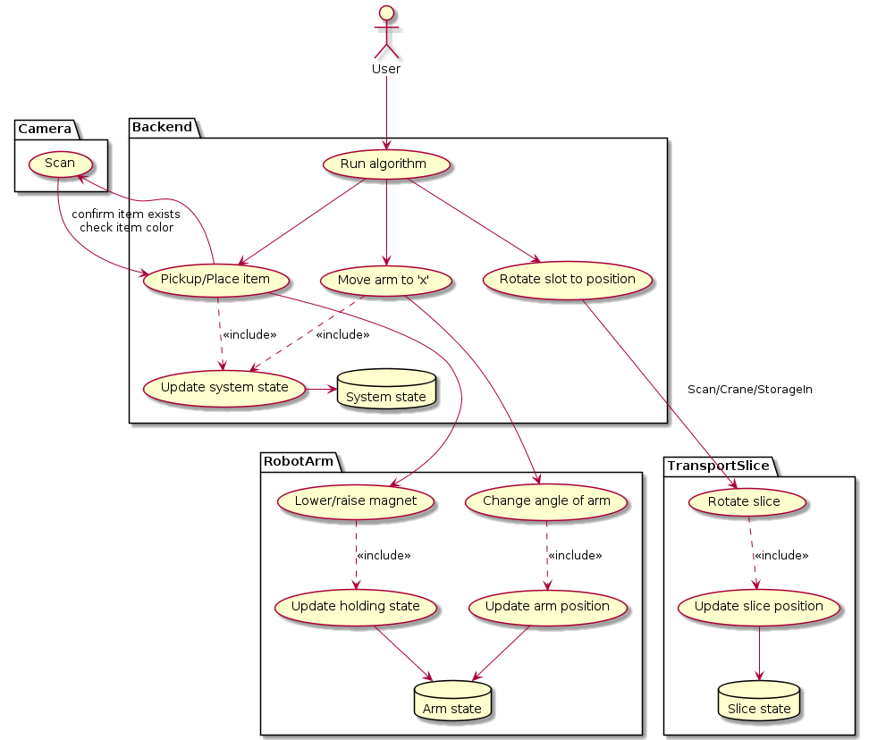

---
title: Assembly Sorter
author: |
    Frederik Alexander Hounsvad (frhou18), Nikolai Emil Damm (nidam16), \
    Oliver Lind Nordestgaard (olnor18), Peter Brændgaard (pebra18),\
    Troels Zink Kristensen (tkris17)
date: 11-02-2022
geometry: margin=2cm
output: pdf_document
...
<!-- Uses pandoc "pandoc project-proposal.md -o project-proposal.pdf" -->

# What is it?

We will make an assembly sorter consisting of a 2-axis crane and a disk that can rotate colored boxes to three distinct zones - a Scanning zone, a pickup/delivery zone, and a storage zone.

# Features

- The 2-axis crane can pick up boxes and put them on the disk.
- The disk can rotate to position its zones depending on the task at hand.
- The camera can scan the box colors to determine where they should be delivered.
- The servo motor is used to rotate the crane's base 360 degrees. The motor should be relatively strong depending on the crane's weight and weight of the objects.
- The stepper motor for the crane winch is used to pull in / push out the string/cable. At the end of the cable is an electromagnet, which can attach to and lift objects. The magnet can be in two states: *pickup* and *release*.
- The stepper motor for the circular disc is used to rotate the disc. The disc is used to store the objects that should be picked up or released. The disc is divided into *x* slots to obtain discrete positions for the crane's TCP (Tool Center Point).
- The camera is used for identifying objects to be sorted and handled accordingly.

# Hardware Components

- Servo motor for crane
- Stepper motor for crane winch
- Stepper motor for storage disc
- Camera that can be used by a raspberry pi (Ribbon connected or USB)
- Electromagnet

We would need materials such as metal and wood to build the circular conveyor and the crane unless Andreas had something we could use.

{#fig:figure0}